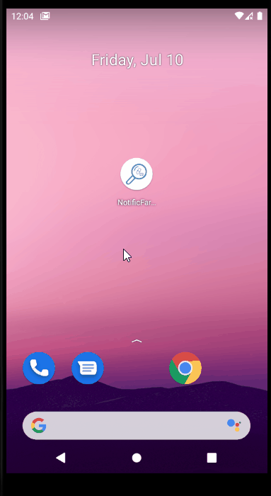

# Introdução

Este app foi desenvolvido a partir de um formulário [formulário](http://formsus.datasus.gov.br/site/formulario.php?id_aplicacao=31480) solicitado por uma universitária do curso de Farmácia.  

O aplicativo foi desenvolvido com o framework Flutter e Firebase Cloud Firestore como backend. Para o gerenciamento de estados dos dados e 
telas foi utilizado o Provider [Provider](https://pub.dev/packages/provider).

## Como funciona

Ao abrir o aplicativo é apresentado uma splash screen antes de terminar a inicialização. A tela principal mostra um lista de todas as notificações armazenadas no Firestore. 

Ao clicar no botão '+' o usuário é direcionado a uma nova tela para o preenchimento do formulário. Os campos com <*> são abrigatórios.

